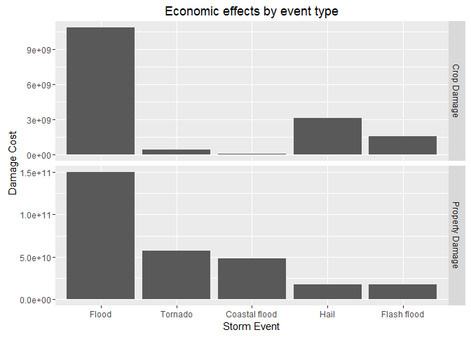

# The Economic and Population Health Consequences of Storm Events Across the United States


##Synopsis
  
Storms and other severe weather events can cause both public health and economic problems for communities and municipalities. Many severe events can result in fatalities, injuries, and property damage, and preventing such outcomes to the extent possible is a key concern.

This project involves exploring the U.S. National Oceanic and Atmospheric Administration's (NOAA) storm. The database tracks characteristics of major storms and weather events in the United States, including when and where they occur, as well as estimates of any fatalities, injuries, and property damage. I analyse the database to evaluate which events are most harmful to population health and have the greatest economic impact.

The data analysis showed that tornadoes have the highest impact to population health, whilst floods have the highest economic impact.
  
##Data Processing
  
The data set is downloaded and the following data processing actions taken:  
  
1. Date variables changed to the date class in R, to facilitate any analysis with dates.  
2. Any NA values in in the CROPDMGEXP and PROPDMGEXP variables are set to 0, otherwise number 4 below won't work.  
3. The CROPDMGEXP and PROPDMGEXP variables are turned into their appropriate numeric value if they were labelled correctly, otherwise they are set to 0, this facilitates number 4 below.  
4. The CROPDMG and PROPDMG are changed to represent the total crop damage and property damage numbers.  
5. The EVTYPE variable is set to uppercase to remove some duplicates, which had different cases.  
6. The EVTYPE variable is then processed such that entries are renamed to the correct storm event description and invalid storm events are subsetted out.  
7. The database is grouped by YEAR, STATE and EVTYPE, a column for frequency added and the columns for FATALITIES, INJURIES, CROPDMG and PROPDMG renamed.
  

```r
download.file("https://d396qusza40orc.cloudfront.net/repdata%2Fdata%2FStormData.csv.bz2","StormData.csv.bz2")
StormData<-read.csv("StormData.csv.bz2")

##Date processing
StormData$BGN_DATE<-as.Date(StormData$BGN_DATE,"%m/%d/%Y %H:%M:%S")
StormData$YEAR<-Year(StormData$BGN_DATE)

##CROPDMG and PROPDMG data processing
StormData$CROPDMGEXP[is.na(StormData$CROPDMGEXP)]<-0
StormData$PROPDMGEXP[is.na(StormData$PROPDMGEXP)]<-0

StormData$CROPDMGEXP <- as.character(StormData$CROPDMGEXP)
StormData$CROPDMGEXP[StormData$CROPDMGEXP %in% c("1","2","3","4","5","6","7","8","9")] <- "0"
StormData$CROPDMGEXP[StormData$CROPDMGEXP %in% c("","?","-","+")] <- "0"
StormData$CROPDMGEXP[StormData$CROPDMGEXP %in% c("h","H")] <- "100"
StormData$CROPDMGEXP[StormData$CROPDMGEXP %in% c("k","K")] <- "1000"
StormData$CROPDMGEXP[StormData$CROPDMGEXP %in% c("m","M")] <- "1000000"
StormData$CROPDMGEXP[StormData$CROPDMGEXP %in% c("b","B")] <- "1000000000"
StormData$CROPDMGEXP <- as.numeric(StormData$CROPDMGEXP)

StormData$PROPDMGEXP <- as.character(StormData$PROPDMGEXP)
StormData$PROPDMGEXP[StormData$PROPDMGEXP %in% c("1","2","3","4","5","6","7","8","9")] <- "0"
StormData$PROPDMGEXP[StormData$PROPDMGEXP %in% c("","?","-","+")] <- "0"
StormData$PROPDMGEXP[StormData$PROPDMGEXP %in% c("h","H")] <- "100"
StormData$PROPDMGEXP[StormData$PROPDMGEXP %in% c("k","K")] <- "1000"
StormData$PROPDMGEXP[StormData$PROPDMGEXP %in% c("m","M")] <- "1000000"
StormData$PROPDMGEXP[StormData$PROPDMGEXP %in% c("b","B")] <- "1000000000"
StormData$PROPDMGEXP <- as.numeric(StormData$PROPDMGEXP)

StormData$CROPDMG<-StormData$CROPDMG*StormData$CROPDMGEXP
StormData$PROPDMG<-StormData$PROPDMG*StormData$PROPDMGEXP

##EVTYPE data processing
StormData$EVTYPE<-toupper(StormData$EVTYPE)
StormData$EVTYPE<-as.factor(StormData$EVTYPE)

# FLOOD related
StormData$EVTYPE[grepl("COASTAL|STORM SURGE", StormData$EVTYPE)] <- "COASTAL FLOOD"
StormData$EVTYPE[grepl("FLASH", StormData$EVTYPE)] <- "FLASH FLOOD"
StormData$EVTYPE[!grepl("FLASH|COASTAL", StormData$EVTYPE) & grepl("FLOOD", StormData$EVTYPE)] <- "FLOOD"
StormData$EVTYPE[grepl("STREAM|URBAN", StormData$EVTYPE)] <- "FLOOD"
# HEAT related
StormData$EVTYPE[grepl("HEAT|DRY", StormData$EVTYPE)] <- "EXCESSIVE HEAT"
StormData$EVTYPE[grepl("HOT|WARM", StormData$EVTYPE)] <- "EXCESSIVE HEAT"
StormData$EVTYPE[grepl("RECORD (HIGH|.*TEMP)|HIGH TEMPERA", StormData$EVTYPE)] <- "EXCESSIVE HEAT"
# COLD related
StormData$EVTYPE[grepl("AVALANCE", StormData$EVTYPE)] <- "AVALANCHE"
StormData$EVTYPE[grepl("SLEET", StormData$EVTYPE)] <- "SLEET"
StormData$EVTYPE[grepl("BLIZZARD", StormData$EVTYPE)] <- "BLIZZARD"
StormData$EVTYPE[grepl("EXTREME", StormData$EVTYPE) & grepl("CHILL|COLD", StormData$EVTYPE)] <- "EXTREME COLD/WIND CHILL"
StormData$EVTYPE[!grepl("EXTREME", StormData$EVTYPE) & grepl("CHILL|COLD", StormData$EVTYPE)] <- "COLD/WIND CHILL"
StormData$EVTYPE[grepl("LAKE", StormData$EVTYPE) & grepl("SNOW", StormData$EVTYPE)] <- "LAKE-EFFECT SNOW"
StormData$EVTYPE[!grepl("LAKE", StormData$EVTYPE) & grepl("SNOW", StormData$EVTYPE)] <- "HEAVY SNOW"
StormData$EVTYPE[grepl("FROST|FREEZE", StormData$EVTYPE)] <- "FROST/FREEZE"
StormData$EVTYPE[!grepl("FROST", StormData$EVTYPE) & grepl("FREEZE", StormData$EVTYPE)] <- "SLEET"
StormData$EVTYPE[grepl("FREEZ", StormData$EVTYPE) & grepl("RAIN", StormData$EVTYPE)] <- "SLEET"
StormData$EVTYPE[grepl("DRIZZLE", StormData$EVTYPE)] <- "SLEET"
StormData$EVTYPE[grepl("(RECORD LOW|LOW TEMP)", StormData$EVTYPE)] <- "EXTREME COLD/WIND CHILL"
StormData$EVTYPE[grepl("GLAZE", StormData$EVTYPE)] <- "EXTREME COLD/WIND CHILL"
StormData$EVTYPE[grepl("ICE", StormData$EVTYPE)] <- "ICE STORM"
StormData$EVTYPE[grepl("WINT", StormData$EVTYPE)] <- "WINTER STORM"
StormData$EVTYPE[grepl("HAIL", StormData$EVTYPE)] <- "HAIL"
# WIND, RAIN and LIGHTING related
StormData$EVTYPE <- gsub("WINDS", "WIND", StormData$EVTYPE)
StormData$EVTYPE <- gsub("WND", "WIND", StormData$EVTYPE)
StormData$EVTYPE[!grepl("DERSTORM WIND", StormData$EVTYPE) & grepl("THUN|TSTM", StormData$EVTYPE)] <- "LIGHTNING"
StormData$EVTYPE[grepl("LIGHT|LIGN", StormData$EVTYPE)] <- "LIGHTNING"
StormData$EVTYPE[grepl("DERSTORM WIND", StormData$EVTYPE)] <- "THUNDERSTORM WIND"
StormData$EVTYPE[grepl("TORN", StormData$EVTYPE)] <- "TORNADO"
StormData$EVTYPE[grepl("SPOUT", StormData$EVTYPE)] <- "WATERSPOUT"
StormData$EVTYPE[grepl("HURRICANE|TYPHOON", StormData$EVTYPE)] <- "HURRICANE (TYPHOON)"
StormData$EVTYPE[grepl("FIRE", StormData$EVTYPE)] <- "WILDFIRE"
StormData$EVTYPE[!grepl("MARINE", StormData$EVTYPE) & grepl("HIGH WIND", StormData$EVTYPE)] <- "HIGH WIND"
StormData$EVTYPE[grepl("GUST", StormData$EVTYPE)] <- "STRONG WIND"
StormData$EVTYPE[!grepl("COLD|MARINE|THUNDER|STRONG|HIGH", StormData$EVTYPE) & grepl("WIND", StormData$EVTYPE)] <- "STRONG WIND"
StormData$EVTYPE[grepl("FUNNEL", StormData$EVTYPE)] <- "FUNNEL CLOUD"
StormData$EVTYPE[grepl("TROPICAL STORM", StormData$EVTYPE)] <- "TROPICAL STORM"
StormData$EVTYPE[!grepl("FREEZIN", StormData$EVTYPE) & grepl("FOG|VOG", StormData$EVTYPE)] <- "DENSE FOG"
StormData$EVTYPE[grepl("WET|RAIN|SHOWER|PRECIP", StormData$EVTYPE)] <- "HEAVY RAIN"
# DUST related
StormData$EVTYPE[grepl("DUST DEVEL", StormData$EVTYPE)] <- "DUST DEVIL"
StormData$EVTYPE[!grepl("DEVIL", StormData$EVTYPE) & grepl("DUST", StormData$EVTYPE)] <- "DUST STORM"
# MARINE
StormData$EVTYPE[grepl("RIP CURRENT", StormData$EVTYPE)] <- "RIP CURRENT"
StormData$EVTYPE[!grepl("LOW", StormData$EVTYPE) & grepl("TIDE|WAVE|SWELL", StormData$EVTYPE)] <- "STORM SURGE/TIDE"
StormData$EVTYPE[grepl("SURF", StormData$EVTYPE)] <- "HIGH SURF"
# MISC
StormData$EVTYPE[grepl("VOLCAN", StormData$EVTYPE)] <- "VOLCANIC ASH"
StormData$EVTYPE[grepl("(MUD|LAND|ROCK).*SLIDE", StormData$EVTYPE)] <- "LANDSLIDE"

ValidEvents<-c("ASTRONOMICAL LOW TIDE","AVALANCHE","BLIZZARD","COASTAL FLOOD","COLD/WIND CHILL","DEBRIS FLOW","DENSE FOG",
               "DENSE SMOKE","DROUGHT","DUST DEVIL","DUST STORM","EXCESSIVE HEAT","EXTREME COLD/WIND CHILL","FLASH FLOOD",
               "FLOOD","FROST/FREEZE","FUNNEL CLOUD","FREEZING FOG","HAIL","HEAT","HEAVY RAIN","HEAVY SNOW","HIGH SURF",
               "HIGH WIND"," HURRICANE (TYPHOON)","ICE STORM","LAKE-EFFECT SNOW","LAKESHORE FLOOD","LIGHTNING","MARINE HAIL",
               "MARINE HIGH WIND","MARINE STRONG WIND","MARINE THUNDERSTORM WIND","RIP CURRENT","SEICHE","SLEET",
               "STORM SURGE/TIDE","STRONG WIND","THUNDERSTORM WIND","TORNADO","TROPICAL DEPRESSION","TROPICAL STORM",
               "TSUNAMI","VOLCANIC ASH","WATERSPOUT","WILDFIRE","WINTER STORM","WINTER WEATHER")

StormData<-StormData[StormData$EVTYPE %in% ValidEvents, ]

##Database processing
StormData<-StormData[ ,c(38,7,8,23,24,25,27)]
StormData<-group_by(StormData,YEAR,EVTYPE)
StormData$EVTYPE<-capitalize(tolower(StormData$EVTYPE))
StormData<-ddply(StormData, c("YEAR","STATE","EVTYPE"), summarise, Frequency=length(EVTYPE), Deaths=sum(FATALITIES),
                 Injuries=sum(INJURIES), CropDamage=sum(CROPDMG), PropertyDamage=sum(PROPDMG))
```
  
##Results
  
The data is grouped by event type and fatalities + injuries and seperately by event type and crop damage + property damage. Tables of the top 10 for each grouping is shown below along with graphs of the top 5 for each grouping. The sorting for population effects assumes that it can be described as the sum of fatalities and injuries. The sorting for the economic effect assumes that it can be described as the sum of the crop and property damage.
  

```r
PeopleHarm<-aggregate(cbind(Injuries, Deaths)~EVTYPE, data=StormData, FUN=sum)
PeopleHarm$TOTAL<-PeopleHarm$Deaths+PeopleHarm$Injuries
PeopleHarm<-PeopleHarm[order(-PeopleHarm$TOTAL)[1:10],]
PeopleHarm
```

```
##               EVTYPE Injuries Deaths TOTAL
## 34           Tornado    91407   5636 97043
## 25         Lightning    12252   1333 13585
## 11    Excessive heat     9272   3181 12453
## 14             Flood     6874    512  7386
## 13       Flash flood     1802   1035  2837
## 33 Thunderstorm wind     2427    209  2636
## 41      Winter storm     1968    279  2247
## 23         Ice storm     2137     97  2234
## 22         High wind     1460    290  1750
## 40          Wildfire     1608     90  1698
```

```r
PGraph<-PeopleHarm[1:5,]
PGraph<-melt(PGraph,id.vars = "EVTYPE",measure.vars = c("Deaths","Injuries"))
PGraph<-transform(PGraph,EVTYPE=reorder(EVTYPE,-value))
ggplot(PGraph,aes(x=EVTYPE,y=value))+geom_bar(stat="identity")+
    facet_grid(variable~.,scales = "free")+ylab("Number")+xlab("Storm Event")+
    labs(title="Effects on population health by event type")
```


```r
EconomicHarm<-aggregate(cbind(CropDamage, PropertyDamage)~EVTYPE, data=StormData, FUN=sum)
EconomicHarm$TOTAL<-EconomicHarm$CropDamage+EconomicHarm$PropertyDamage
EconomicHarm<-EconomicHarm[order(-EconomicHarm$TOTAL)[1:10],]
EconomicHarm
```

```
##            EVTYPE  CropDamage PropertyDamage        TOTAL
## 14          Flood 10856344050   150247521350 161103865400
## 34        Tornado   414961310    56993098180  57408059490
## 4   Coastal flood      911000    48398656060  48399567060
## 18           Hail  3114212850    17619991220  20734204070
## 13    Flash flood  1532197150    16907927610  18440124760
## 8         Drought 13972566000     1046106000  15018672000
## 23      Ice storm  5022113500     3961199810   8983313310
## 40       Wildfire   403281630     8496628500   8899910130
## 36 Tropical storm   694896000     7714390550   8409286550
## 25      Lightning   584315440     6647716320   7232031760
```

```r
EGraph<-EconomicHarm[1:5,]
EGraph<-melt(EGraph,id.vars = "EVTYPE",measure.vars = c("CropDamage","PropertyDamage"))
EGraph<-transform(EGraph,EVTYPE=reorder(EVTYPE,-value))
labels <- c("PropertyDamage" = "Property Damage", "CropDamage" = "Crop Damage")
ggplot(EGraph,aes(x=EVTYPE,y=value))+geom_bar(stat="identity")+
    facet_grid(variable~.,scales = "free", labeller = labeller(variable = labels))+
    ylab("Damage Cost")+xlab("Storm Event")+labs(title="Economic effects by event type")
```


  
##Conclusion
  
The first plot shows that a tornado leads (by far) to the most fatalities and injuries, compared to the runners up - lightning, excessive heat, floods and flash floods. The number of fatalities is always a lot smaller than the number of injuries.  
The second plot shows that a flood leads to the highest economic damage (both property and crops), compared to the runners up - tornadoes, coastal floods, hail and flash floods. In general the damage cost to property is orders of magnitude higher than the damage cost to crops.
